# Home Lab Walkthrough: pfSense -firewall, Kali Linux, and Ubuntu DoS Defence Demo

## 1. Introduction

This home lab demonstrates how a pfSense firewall can be used to control traffic between an attacker machine and a victim machine in a virtual network.

The lab uses three virtual machines in Oracle VirtualBox:

- **pfSense** as the firewall/router
- **Kali Linux** as the attacker machine
- **Ubuntu SOC Lab** as the victim machine

The aim of the lab is to show how Kali can send ICMP traffic to Ubuntu, how this traffic can be seen in Wireshark, and how pfSense can block the traffic using firewall rules.

---

## 2. Lab Topology

The lab uses two network areas.

### WAN side

The WAN side is connected to the home network using a Bridged Adapter. Kali Linux is placed on this side, and the pfSense WAN interface is also connected to this side.

### LAN side

The LAN side uses an internal VirtualBox network. Ubuntu is placed behind pfSense on this internal LAN side.

### Final IP Address Plan

| Device | Role | IP Address |
|---|---|---|
| Kali Linux | Attacker | `192.168.1.245` |
| pfSense WAN | Firewall WAN side | `192.168.1.90` |
| pfSense LAN | Firewall LAN side | `192.168.10.1` |
| Ubuntu SOC Lab | Victim | `192.168.10.100` |

---

## 3. VirtualBox Network Settings

### pfSense VM

pfSense was configured with two network adapters:

| Adapter | Setting | Purpose |
|---|---|---|
| Adapter 1 | Bridged Adapter | WAN side, connected to the home network |
| Adapter 2 | Internal Network `intnet` | LAN side, connected to Ubuntu |

The pfSense WAN received an IP address from the home network:

```text
pfSense WAN: 192.168.1.90
```

The pfSense LAN was configured manually as:

```text
pfSense LAN: 192.168.10.1/24
```

### Ubuntu SOC Lab VM

Ubuntu was placed behind pfSense on the internal network:

```text
Adapter 1: Internal Network
Name: intnet
```

Ubuntu received its IP address from the pfSense DHCP server:

```text
Ubuntu IP: 192.168.10.100
```

---

## 4. pfSense Interface Configuration


**Figure 1:** pfSense console showing the WAN interface IP address `192.168.1.90` and the LAN interface IP address `192.168.10.1`.

The pfSense console confirms that both firewall interfaces are configured correctly. The WAN interface is connected to the home network and received the IP address `192.168.1.90`. The LAN interface is connected to the internal lab network and uses the IP address `192.168.10.1`.

---

## 5. Ubuntu Internal Network Configuration

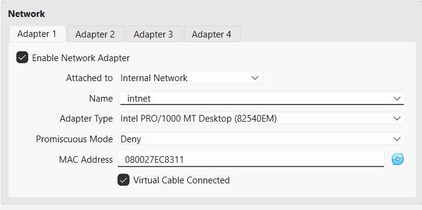

**Figure 2:** Ubuntu SOC Lab network adapter configured as Internal Network using the `intnet` network.

This setting places the Ubuntu SOC Lab machine on the internal lab network behind pfSense. The adapter is connected to the VirtualBox Internal Network named `intnet`, which allows Ubuntu to communicate with the pfSense LAN interface.

---

## 6. Kali Linux IP Address

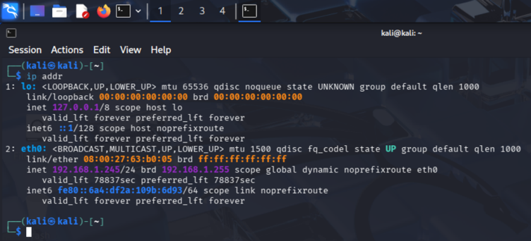

**Figure 3:** Kali Linux terminal showing the `eth0` interface with IP address `192.168.1.245`.

The Kali Linux machine is connected to the WAN side of the lab using a Bridged Adapter. The `ip addr` command confirms that Kali received the IP address `192.168.1.245` from the home network. This IP address is later used in pfSense firewall rules as the source address for the attacker machine.

---

## 7. Installing and Configuring pfSense

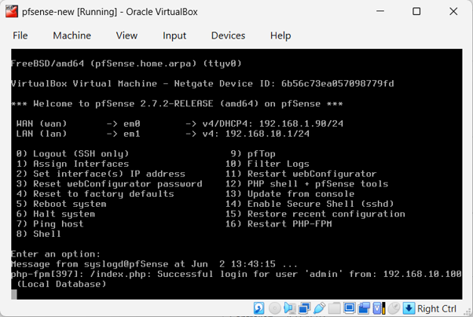

**Figure 4:** pfSense console menu after successful installation, showing the WAN and LAN interfaces configured.

After installation, pfSense booted successfully into the console menu. The console shows that the WAN interface is assigned to `em0` with IP address `192.168.1.90`, and the LAN interface is assigned to `em1` with IP address `192.168.10.1`. This confirms that pfSense is installed and both network interfaces are active.

---

## 8. Changing the pfSense LAN Network

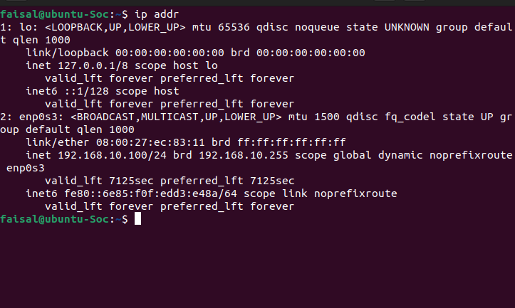

**Figure 5:** Ubuntu SOC Lab terminal showing the `enp0s3` interface with IP address `192.168.10.100`.

The Ubuntu SOC Lab machine is connected to the internal network behind pfSense. The `ip addr` command confirms that Ubuntu received the IP address `192.168.10.100` from the pfSense DHCP server.

---

## 9. Accessing the pfSense Web Interface

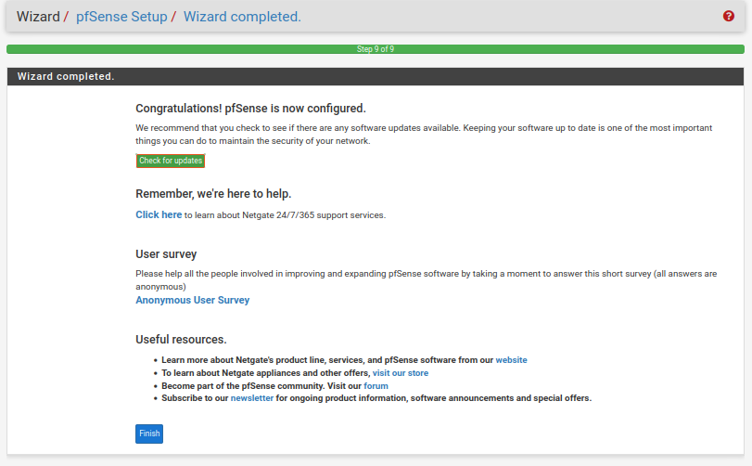

**Figure 6:** pfSense setup wizard completed page confirming that pfSense is configured.

The pfSense setup wizard was completed successfully. This confirms that the basic pfSense configuration, including hostname, DNS, WAN, LAN, and admin password settings, was applied.

---

## 10. Adding a Route on Kali

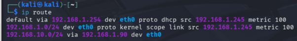

**Figure 7:** Kali Linux routing table showing the route to the pfSense LAN network `192.168.10.0/24` via pfSense WAN address `192.168.1.90`.

A static route was added on Kali so it can reach the Ubuntu victim machine behind pfSense. The route sends any traffic for the `192.168.10.0/24` network through the pfSense WAN interface at `192.168.1.90`.

The route command used was:

```bash
sudo ip route add 192.168.10.0/24 via 192.168.1.90
```

---

## 11. Allowing Kali Through pfSense

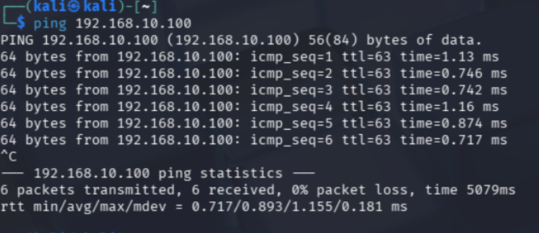

**Figure 8:** Kali Linux successfully pinging the Ubuntu victim machine at `192.168.10.100`.

The successful ping confirms that Kali can reach the Ubuntu victim machine through pfSense. The replies from `192.168.10.100` show that the static route on Kali and the pfSense WAN firewall allow rule are working correctly.

---

## 12. Installing and Opening Wireshark on Ubuntu

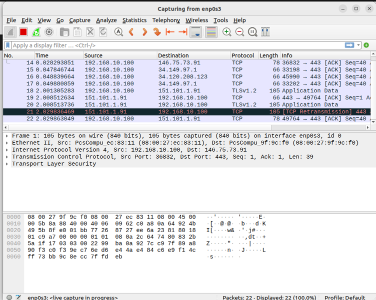

**Figure 9:** Wireshark running on Ubuntu and capturing live network traffic on the `enp0s3` interface.

Wireshark was started on the Ubuntu victim machine and the `enp0s3` interface was selected for packet capture. This interface is connected to the pfSense LAN network, so it can be used to observe traffic reaching the Ubuntu machine during the DoS demonstration.

---

## 13. Testing ICMP Traffic

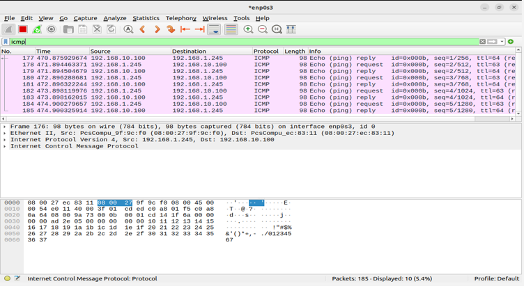

**Figure 10:** Wireshark showing ICMP echo request packets sent from Kali Linux `192.168.1.245` to Ubuntu `192.168.10.100`.

The Wireshark capture shows ICMP echo request packets travelling from Kali Linux to the Ubuntu victim machine. This confirms that the traffic generated from Kali is reaching Ubuntu through the pfSense firewall before the blocking rule is applied.

---

## 14. DoS Demonstration Using hping3

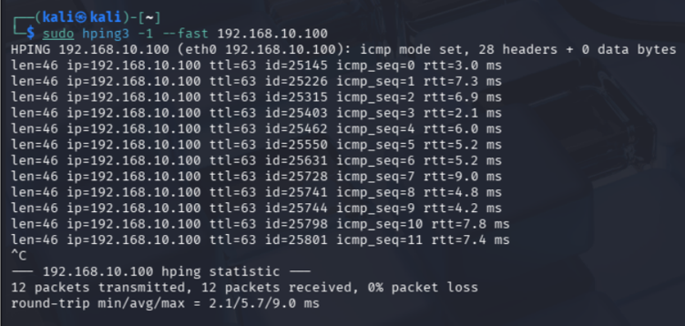

**Figure 11:** Kali Linux running `hping3` to send ICMP traffic to the Ubuntu victim machine at `192.168.10.100`.

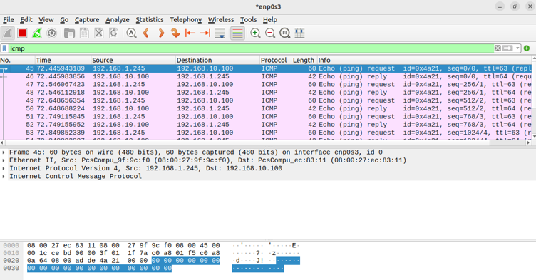

**Figure 12:** Wireshark showing multiple ICMP packets reaching Ubuntu from Kali during the `hping3` traffic demonstration.

The DoS demonstration was carried out inside an isolated VirtualBox lab. Kali Linux was used as the attacker machine, and Ubuntu was used as the victim machine behind the pfSense firewall.

Wireshark was started on Ubuntu and configured to capture traffic on the `enp0s3` interface. The display filter `icmp` was applied so that only ICMP packets would be shown.

On Kali Linux, the `hping3` tool was used to generate ICMP traffic towards Ubuntu. The command used was:

```bash
sudo hping3 -1 --fast 192.168.10.100
```

This sent repeated ICMP packets from Kali to Ubuntu. In Wireshark, the traffic appeared as ICMP echo request packets from `192.168.1.245` to `192.168.10.100`, with echo replies returning from Ubuntu. This confirmed that Kali traffic was reaching the Ubuntu victim machine through pfSense before the blocking rule was applied.

---

## 15. Blocking the Kali Traffic in pfSense

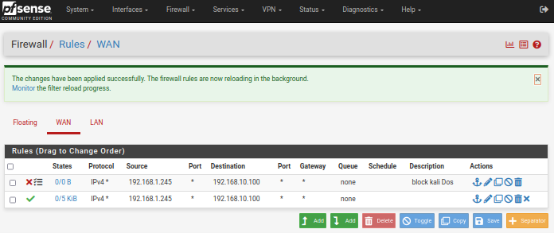

**Figure 13:** pfSense WAN firewall rules showing the Block Kali DoS rule above the allow rule.

The pfSense WAN rules show that traffic from Kali Linux at `192.168.1.245` to the Ubuntu victim machine at `192.168.10.100` is now blocked. The block rule is placed above the earlier allow rule because pfSense processes firewall rules from top to bottom. This means the block rule is matched first, preventing the Kali traffic from reaching Ubuntu.

---

## 16. Verifying the Block

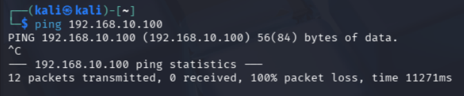

**Figure 14:** Kali Linux ping to Ubuntu fails after the pfSense block rule is applied.

After the Block Kali DoS rule was applied in pfSense, Kali was no longer able to reach the Ubuntu victim machine. The ping test shows `100% packet loss`, confirming that pfSense successfully blocked traffic from Kali at `192.168.1.245` to Ubuntu at `192.168.10.100`.

---

## 17. Final Result

The pfSense, Kali Linux, and Ubuntu home lab was completed successfully.

The final network configuration was:

| Machine | Role | IP Address |
|---|---|---|
| Kali Linux | Attacker | `192.168.1.245` |
| pfSense WAN | Firewall WAN interface | `192.168.1.90` |
| pfSense LAN | Firewall LAN interface | `192.168.10.1` |
| Ubuntu SOC Lab | Victim machine | `192.168.10.100` |

The Ubuntu machine was placed behind the pfSense firewall on the internal LAN, while Kali was placed on the WAN side as the attacker. A static route and pfSense allow rule were added so Kali could reach Ubuntu for testing.

Wireshark on Ubuntu confirmed that ICMP traffic from Kali was reaching the victim machine. A DoS-style test was then performed using `hping3`, producing repeated ICMP packets visible in Wireshark.

Finally, a pfSense block rule was added above the allow rule to stop traffic from Kali `192.168.1.245` to Ubuntu `192.168.10.100`. After applying the rule, Kali could no longer ping Ubuntu, showing `100% packet loss`. This confirmed that pfSense successfully blocked the traffic and demonstrated how firewall rules can control and protect an internal network.

---
by Faisal N Saleem
## Disclaimer

This lab was performed in an isolated VirtualBox environment for educational purposes only. No external systems were targeted.
